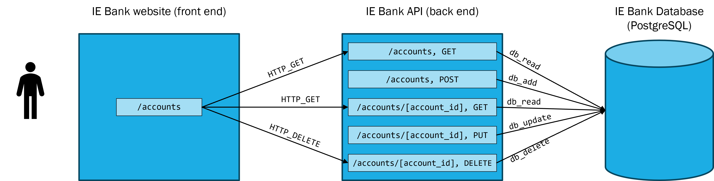

# IE Bank frontend

- [IE Bank frontend](#ie-bank-frontend)
  - [Overview](#overview)
  - [Requirements](#requirements)
  - [Recommended tutorials](#recommended-tutorials)
  - [Configure your local environment](#configure-your-local-environment)
    - [Install Prerequisites](#install-prerequisites)
    - [Install node dependencies](#install-node-dependencies)
  - [Run and debug the backend locally](#run-and-debug-the-backend-locally)
  - [Configuration variables](#configuration-variables)
  - [Continuos Delivery](#continuos-delivery)
    - [GitHub secrets](#github-secrets)


## Overview

This is the repository for the frontend code of the IE Bank web app



## Requirements

This source code works under the following technologies:
- [Node v18.17.1](https://nodejs.org/en/download)
- [npm 9.6.7 (comes with Node)](https://www.npmjs.com/package/npm)

## Recommended tutorials
- [HTML](https://www.w3schools.com/html/)
- [CSS](https://www.w3schools.com/css/default.asp)
- [JavaScript](https://www.w3schools.com/js/default.asp)
- [Node.js](https://www.w3schools.com/nodejs/default.asp)
- [Vue.js](https://www.w3schools.com/vue/index.php)
- [Node.js in VS Code](https://code.visualstudio.com/docs/nodejs/nodejs-tutorial)
- [Using Vue in VS Code](https://code.visualstudio.com/docs/nodejs/vuejs-tutorial)

## Configure your local environment

### Install Prerequisites

- **Install Node.js**. Install Node.js from [here](https://nodejs.org/en/download). Make sure to select the option to add Node to your PATH while installing.
- **Install VSCode**. Install VSCode from [here](https://code.visualstudio.com/download).
- **Install Vetur VSCode extension**. Install the Vetur VSCode extension from [here](https://marketplace.visualstudio.com/items?itemName=octref.vetur).

### Install node dependencies

> Learn more: [Using Vue in Visual Studio Code](https://code.visualstudio.com/docs/nodejs/vuejs-tutorial)

1. **Install node dependencies**. Open a terminal and run the following command on the root folder of this project:

```bash
$ npm install
```

This will create a `node_modules` folder with all the dependencies needed to run the application configured in the `package.json` file.

## Run and debug the backend locally

> Learn more: [Vue.js debugging in Chrome and VS Code](https://github.com/microsoft/vscode-recipes/tree/main/vuejs-cli#configure-launchjson-file)

1. **Configure the `launch.json` file**. Click on the Debugging icon in the Activity Bar to bring up the Debug view. Then click on the gear icon to configure a `launch.json` file, selecting Chrome for the environment:


2. **Configure the `tasks.json` file**. Replace content of the generated `launch.json` with the following configurations:

```json
{
    // Use IntelliSense to learn about possible attributes.
    // Hover to view descriptions of existing attributes.
    // For more information, visit: https://go.microsoft.com/fwlink/?linkid=830387
    "version": "0.2.0",
    "configurations": [
        {
            "type": "msedge",
            "request": "launch",
            "name": "IE Bank Frontend",
            "url": "http://localhost:8080",
            "webRoot": "${workspaceFolder}",
            "breakOnLoad": true,
            "pathMapping": {
              "/_karma_webpack_": "${workspaceFolder}"
            },
            "sourceMapPathOverrides": {
              "webpack:/*": "${webRoot}/*",
              "/./*": "${webRoot}/*",
              "/src/*": "${webRoot}/*",
              "/*": "*",
              "/./~/*": "${webRoot}/node_modules/*"
            },
            "preLaunchTask": "vuejs: start"
        }
    ]
}
```

2. Add the following `npm` tasks to you  `tasks.json` file:

```json
{
    "version": "2.0.0",
    "tasks": [
        {
            "label": "vuejs: build",
            "type": "npm",
            "script": "install",
            "isBackground": true
        },
        {
            "label": "vuejs: start",
            "type": "npm",
            "script": "serve",
            "isBackground": true
        }
    ]
}
```

3. **Start debugging**. Set a [breakpoint](https://code.visualstudio.com/docs/editor/debugging#_breakpoints) anywhere in the [`src\components\AppAccounts.vue`](src\components\AppAccounts.vue) file. Go to the Debug view, select the 'IE Bank Frontend' configuration, then press F5 or click the green play button. Your breakpoint should now be hit as the new instance of Chrome opens

## Configuration variables

> Learn more: [Modes and Environment Variables](https://cli.vuejs.org/guide/mode-and-env.html)

**Mode** is an important concept in Vue CLI projects. By default, there are three modes:
- `development` is used by `vue-cli-service serve`
- `test` is used by `vue-cli-service test:unit`
- `production` is used by `vue-cli-service build` and `vue-cli-service test:e2e`

When running `vue-cli-service`, environment variables are loaded from all corresponding files. If they don't contain a `NODE_ENV` variable, it will be set accordingly (`NODE_ENV` will be set to `"production"` in production mode, `"test"` in test mode, and defaults to `"development"` otherwise).

You can specify env variables by placing the following files in your project root:

```shell
.env                # loaded in all cases
.env.local          # loaded in all cases, ignored by git
.env.[mode]         # only loaded in specified mode
.env.[mode].local   # only loaded in specified mode, ignored by git
```
It is possible to define the mode to use at build time by using the `--mode` option. For example, to build for uat mode:

- `vue-cli-service build --mode uat` builds a production app in uat mode, using `.env`, `.env.uat` and `.env.uat.local` if they are present

The environment variables are specified in this project root:
- [`.env.development`](.env.development)

Only `NODE_ENV`, `BASE_URL`, and variables that start with `VUE_APP_` will be statically embedded into the client bundle, so do not use variables with other naming convention.

## Continuos Delivery

> Learn more: 
> - [Vue Deployment on App Service Linux](https://azureossd.github.io/2022/02/11/Vue-Deployment-on-App-Service-Linux/)

The file [`.github/workflows/ie-bank-frontend.yml`](.github\workflows\ie-bank-frontend.yml) contains the configuration for the CI/CD pipeline.

### GitHub secrets

The workflow uses the following GitHub secrets:

Secret name | Description | Learn more
--- | --- | ---
`AZURE_CREDENTIALS` | Azure credentials to authenticate to Azure via Service Principal | [Use the Azure login action with a service principal secret](https://learn.microsoft.com/en-us/azure/developer/github/connect-from-azure?tabs=azure-portal%2Clinux#use-the-azure-login-action-with-a-service-principal-secret)